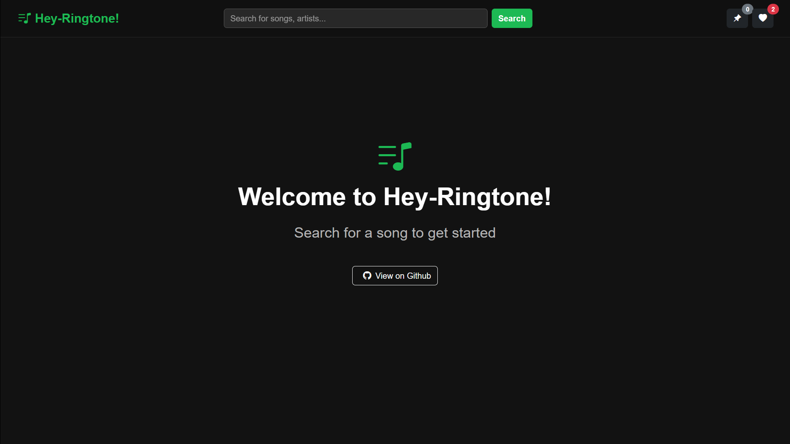

# Hey-Ringone! 🎵


Live Demo: [Link](https://github.com/antra1947/VibeStream-)


An interactive music streaming platform built with React that allows users to search for songs, listen to previews, and curate their own lists of liked and pinned tracks.

<!-- Optional: Add a screenshot of your project -->



## About The Project

Hey-Music is a front-end web application that leverages the Spotify API to provide a seamless music discovery experience. Users can search for any track and instantly play a 30-second preview. The application features a clean, modern, dark-themed UI and persists user preferences using their browser's local storage.

### Key Features

*   **🔍 Dynamic Song Search:** Instantly search the vast Spotify library for any track.
*   **▶️ Audio Previews:** Listen to 30-second song previews directly in the app.
*   **❤️ Like System:** Mark your favorite songs and view them in a dedicated "Liked" list.
*   **📌 Pin Feature:** Pin important tracks for quick access.
*   **💾 Persistent Storage:** Your liked and pinned songs are saved in your browser, so they're waiting for you when you return.
*   **📱 Responsive Design:** A clean and functional layout that works on desktop and mobile devices.

---

## Built With

This project was built using modern web technologies:

*   **[React.js](https://reactjs.org/)** - A JavaScript library for building user interfaces.
*   **[React Hooks](https://reactjs.org/docs/hooks-intro.html)** - For state management (`useState`, `useContext`) and side effects (`useEffect`).
*   **[Bootstrap 5](https://getbootstrap.com/)** - For the responsive grid system and pre-styled components.
*   **[React Router](https://reactrouter.com/)** - For client-side navigation.
*   **[Spotify API](https://developer.spotify.com/documentation/web-api/)** - Accessed via a [NocodeAPI](https://nocodeapi.com/) proxy for simplicity.

---

## Getting Started

To get a local copy up and running, follow these simple steps.

### Prerequisites

Make sure you have Node.js and npm installed on your machine.
*   **npm**
    ```sh
    npm install npm@latest -g
    ```

### Installation

1.  **Clone the repository**
    ```sh
    git clone https://github.com/antra1947/VibeStream-.git
    ```
2.  **Navigate to the project directory**
    ```sh
    cd VibeStream
    ```
3.  **Install NPM packages**
    ```sh
    npm install
    ```
4.  **Set up your API Key**

    This project uses an API proxy from NocodeAPI. To make it work, you need to create a `.env` file in the root of your project.

    *   Create a file named `.env`
    *   Add your API URL to it like this:
        ```
        REACT_APP_NOCODE_API_URL=https://v1.nocodeapi.com/your/unique/path
        ```
    *   **Important:** You then need to update the `fetch` call in `src/App.js` to use this environment variable:
        ```javascript
        // In App.js
        const response = await fetch(process.env.REACT_APP_NOCODE_API_URL + `/search?type=track&q=${keyword}&offset=${offset}`);
        ```

5.  **Start the development server**
    ```sh
    npm start
    ```
    The application will open automatically at `http://localhost:3000`.

---

## Contact

Antra Gupta - [@antra1947](https://github.com/antra1947)

Live Demo: [Link](https://antra1947.github.io/VibeStream-/)

---

## License

Distributed under the MIT License.
